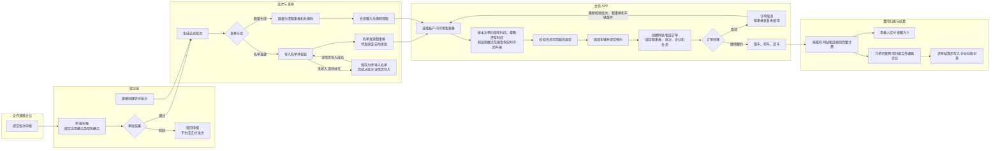
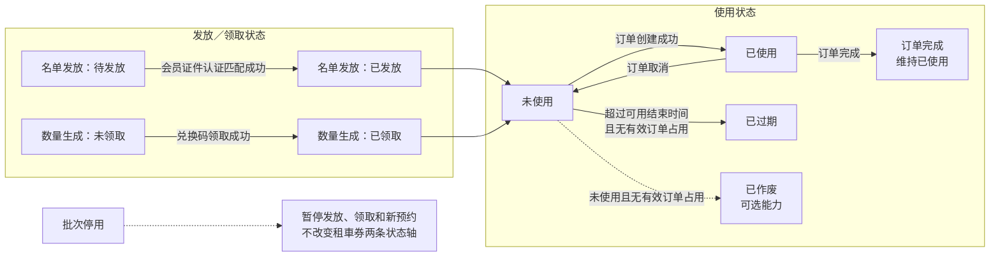
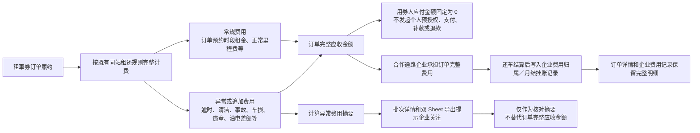

# 合作通路租車券预约（同站租还）

## 版本更新记录

| 版本   | 日期         | 更新内容                                                                                                                                                                                       |
| ---- | ---------- | ------------------------------------------------------------------------------------------------------------------------------------------------------------------------------------------ |
|      |            |                                                                                                                                                                                            |
|      |            |                                                                                                                                                                                            |
|      |            |                                                                                                                                                                                            |
| v1.8 | 2026-07-31 | 车辆库存提醒改为按批次整体计算最坏情况下的剩余车辆及库存风险。                                                                                                                                                            |
| v1.7 | 2026-07-21 | 将固定取还车时间调整为指定用车时段：批次配置最早取车时间和最晚还车时间；APP 可在该范围内传入预约取车时间，预约还车时间必须等于最晚还车时间。                                                                                                                   |
| v1.6 | 2026-07-20 | 按当前 PRD 正文补充端到端业务流程图、租車券双状态流转图、订单费用归属与结算流程图；不新增业务规则。                                                                                                                                       |
| v1.5 | 2026-07-16 | 明确正式批次编辑时锁定发券方式、批次状态、租車券数量和用券人名单；名单或数量追加只能从批次详情页独立操作。                                                                                                                                      |
| v1.4 | 2026-07-09 | 补充企业申报审批、证件号码名单发放、固定时长模式预留；明确租車券订单复用企业费用归属 / 月结挂账计费结算能力，租車券列表增加订单异常费用摘要，导出 Excel 改为租車券列表和订单完整数据两个 Sheet。                                                                                   |
| v1.3 | 2026-07-08 | 合并 2026-07-08 多次修订并精简 PRD 结构：合作通路租車券定位不再限定旅行社；支持名单发放和数量生成；同一手机号可生成多张租車券；同一会员可用不同租車券创建多笔同时间订单；据点范围改为据点类型 + 适用据点；补充微电车、会员可用载具类型、批次详情独立页、新增租車券、名单后续追加导入、导出、操作记录、批次启用 / 停用影响、车辆库存提醒和租車券作废可选能力。 |
| v1.2 | 2026-05-25 | 补充租車券自动发放、可用时间段、车辆库存提醒、据点范围隔离、租車券列表导出、微电车与会员可用载具类型、会员审核统一提交等规则。                                                                                                                            |
| v1.0 | 2026-05-07 | 建立合作通路租車券预约一期方案，限定为分时租赁同站租还，明确合作通路企业费用归属、用券人免支付和企业端只读核对口径。                                                                                                                                 |

版本标记说明：正文只保留当前有效规则；`[版本 新增]`、`[版本 调整]` 用于标记当前版本的关键变化，完整的新旧规则对照见文末“版本变更明细”。

## 1. 文档定位

本文定义合作通路企业发放租車券的一期实现方式。

本功能不是旅行社专属能力。旅行社团体游客租车只是首个落地场景；后续营运商与其他企业做活动合作时，也使用同一套能力创建租車券。

合作通路租車券属于分时租赁功能，可按服务模式扩展到同站租还与甲租乙还，不作为独立业务线。本 PRD 只定义一期同站租还实现；甲租乙还的批次取还据点、费用、库存和订单校验规则需要在后续范围确认后另行补充，不纳入本期开发。用券人仍是个人会员，不加入合作通路企业，不生成企业员工关系。合作通路企业只是费用承担方和核对方。

本期设计原则：

1. 租車券不是普通优惠券。租車券会锁定服务类型、指定用车时段、适用据点范围和费用归属。指定用车时段由最早取车时间和最晚还车时间组成。
2. 租車券订单仍是公开 APP 分时租赁同站租还订单。
3. 租車券订单不发起个人预授权、个人支付和个人退款。
4. 租車券订单底层复用既有企业费用归属 / 企业月结挂账的计费结算能力，不新增租車券专属计费规则。
5. 还车后订单完整费用记录到租車券所属合作通路企业客户名下。
6. 本期不做车辆预留，不写入车辆排程占用，不保证每张未使用租車券查询时一定有车。
7. 一般预约入口只查询据点类型为“一般预约开放”的据点；租車券模式按批次配置的据点类型和适用据点查询。

## 2. 核心流程

1. 租車券批次可以由营运端直接创建，也可以由合作通路企业在企业端提交申报。
2. 企业线上申报先生成申报单；营运端审批通过后，系统才生成正式租車券批次。审批驳回不生成批次。
3. 创建或审批批次时校验合作通路企业具备合作通路挂账 / 企业月结费用归属能力。
4. 企业申报固定服务、指定用车时段和发券方式；营运端审批时为申报绑定适用据点类型和适用据点。
5. 发券方式支持名单发放或数量生成。
6. 营运端直接创建名单发放批次时，可先保存为待导入名单；企业线上申报名单发放批次时，提交审批前必须完成名单导入和校验。
7. 数量生成时，系统按填写数量生成租車券和兑换码；用券人在 APP 输入兑换码后领取到账户。
8. 用券人在 APP 选择账户内已发放 / 已领取、未使用、未过期、未作废的租車券。
9. APP 在租車券指定用车时段内确定本次预约取车时间，并使用租車券最晚还车时间和适用据点范围查询实时可用车辆。
10. 系统按车辆载具类型校验会员可用载具类型。
11. 用券人选择车辆并提交订单。
12. 后端创建同站租还订单，绑定租車券、批次、合作通路企业和使用会员，租車券变为已使用。
13. 订单取消后租車券恢复未使用；只要租車券未过期，允许重新预约。
14. 还车结算后，费用记录到合作通路企业客户名下。

### 2.1 端到端业务流程图

## 3. 核心对象与状态

### 3.1 核心对象

| 对象       | 说明                                                                           |
| -------- | ---------------------------------------------------------------------------- |
| 合作通路企业   | 企业客户的一种合作方类型，用于承担租車券订单费用，可以是旅行社，也可以是其他活动合作企业。                                |
| 租車券批次申报单 | 企业端主动提交的批次申请，记录企业可填写的活动与发券资料、申报版本、审批状态和审批记录；不包含营运方内部据点资源，审批通过前不是正式批次，不生成租車券。 |
| 租車券批次    | 由营运端直接创建，或由企业申报审批通过后生成的正式批次，定义合作企业、发券方式、指定用车时段、可预约期间、适用据点范围和租車券数量。           |
| 用券人名单    | 名单发放时导入的姓名和证件号码，用于按名单行逐条生成租車券。证件号码可以是身份证号码或入台证号码，名单不设置证件类型字段。                |
| 租車券      | 合作通路企业承担费用的租车权益凭证，可通过名单发放到账户，也可通过兑换码领取到账户。                                   |
| 兑换码      | 数量生成方式下产生的领取凭证。用户在 APP 输入兑换码并校验通过后，租車券绑定当前会员账户。                              |
| 租車券订单    | 用券人使用租車券创建的分时租赁同站租还订单。                                                       |

### 3.2 批次状态

| 状态    | 规则                                                                                                            |
| ----- | ------------------------------------------------------------------------------------------------------------- |
| 待导入名单 | 名单发放批次已保存基础信息，但尚未导入用券人名单。该状态下不生成租車券，APP 不可见，不参与用券查询，不允许创建订单。                                                  |
| 启用    | 当前时间处于可用时间段内时，已发放 / 已领取、未使用、未过期、未作废的租車券可在 APP 使用；名单发放的待发放且未作废租車券可在会员完成证件认证并匹配成功后自动发放；数量生成的未领取且未作废租車券可通过兑换码领取。 |
| 停用    | 停用是暂停未创建订单的租車券使用、领取和发放。已发放 / 已领取但未使用的租車券不可预约；名单发放的待发放租車券暂停自动发放；数量生成的兑换码暂停领取；已创建订单不受影响。                        |

名单发放批次在待导入名单状态下，编辑弹窗只允许编辑批次基础信息；用券人名单必须从批次详情页导入。该状态不允许 APP 使用。首次后续导入名单成功后，批次默认由待导入名单转为停用，营运人员确认名单和批次资料无误后再手动启用。

批次停用不回滚已发放 / 已领取记录，不取消已创建订单，不影响已预约、用车中、已完成订单继续按原订单流程处理。用户已进入预约页但尚未创建订单时，提交订单必须由后端重新校验批次状态并拦截。

启用 / 停用批次必须填写原因或备注，并写入操作记录。重新启用后，未使用且未过期的租車券恢复可用，待发放且未过期的租車券恢复自动发放能力，未领取且未过期的兑换码恢复领取能力；已过期租車券不恢复。

### 3.3 租車券使用状态

| 状态  | 说明                                  |
| --- | ----------------------------------- |
| 未使用 | 已生成，当前没有有效订单占用。                     |
| 已使用 | 已成功创建订单。                            |
| 已过期 | 当前时间超过租車券可用结束时间，且当前没有有效订单占用。        |
| 已作废 | 营运人员在批次详情中手动作废，后续不得发放、领取、查询车辆或创建订单。 |

状态规则：

1. 租車券生成后默认为未使用。
2. 创建订单成功后变为已使用。
3. 订单取消后恢复未使用；未过期时允许重新预约。
4. 已过期租車券不得查询车辆、创建订单、兑换或自动发放到账户。
5. 同一个租車券同一时间只能关联一笔有效订单。
6. 创建订单时，后端必须在同一事务中校验租車券为未使用、已发放或已领取、批次启用且未过期，并更新为已使用。
7. 已作废租車券不得恢复使用；如需补发，通过批次详情新增租車券处理。

### 3.4 发放 / 领取状态

| 状态   | 说明                                              |
| ---- | ----------------------------------------------- |
| 未领取  | 数量生成方式下，租車券和兑换码已生成，但尚未被任何会员领取。                  |
| 待发放  | 名单证件号码尚未匹配到会员已认证的身份证或入台证资料，租車券已生成但未发放到账户。       |
| 已发放  | 名单证件号码已匹配会员已认证的身份证或入台证资料，租車券已发放到该会员账户，只允许该会员使用。 |
| 已领取  | 数量生成方式下，用户已通过兑换码领取到当前会员账户，只允许该会员使用。             |
| 发放失败 | 名单数据异常或系统发放异常，需要营运人员处理。                         |

发放规则：

1. 同一批次内证件号码不得重复，包括首次导入、同一次导入文件和后续追加导入；重复时导入失败，不生成租車券。
2. 证件号码比较前去除前后空格并统一英文字母大小写；标准化后相同即视为重复。
3. 系统使用证件号码匹配会员已认证的身份证号码或入台证号码，不要求名单提供证件类型。
4. 同一证件号码只能匹配一个会员账户；匹配到多个会员账户时视为会员资料异常，不自动发放，由营运人员处理。
5. 会员注册但尚未完成对应证件认证时，租車券保持待发放；会员后续完成证件认证后，系统自动匹配批次启用、未使用、未过期、未作废且证件号码一致的待发放租車券并发放到账户。
6. 数量生成租車券初始为未领取；用户输入兑换码后，系统校验兑换码存在、批次启用、未领取、未使用、未过期、未作废且当前时间在可用时间段内，校验通过后更新为已领取。
7. 已领取、已发放、已使用、已过期或批次停用的兑换码不得再次领取。

### 3.5 批次申报状态

申报状态只用于企业线上申报，不作为正式批次状态。

| 状态  | 进入条件             | 允许操作                              |
| --- | ---------------- | --------------------------------- |
| 草稿  | 企业保存但未提交审批。      | 企业可编辑、提交审批。                       |
| 待审批 | 企业完成必填校验并提交。     | 企业可查看或撤回；营运端可审批通过或驳回。             |
| 已撤回 | 企业在营运审批前主动撤回。    | 申报内容保留并转回可编辑草稿。                   |
| 已驳回 | 营运端审批不通过。        | 企业查看驳回原因、修改后重新提交；沿用原申报单编号并增加申报版本。 |
| 已通过 | 营运端审批通过，正式批次已生成。 | 企业查看生成的正式批次；申报内容不得再修改。            |

规则：

1. 审批通过与正式批次生成必须在同一事务内完成，重复审批请求不得重复生成批次。
2. 审批通过后，申报单保存正式批次 ID 和批次编号；企业统一列表只展示生成后的正式批次，不再重复显示一条“已通过”申报记录。
3. 企业撤回待审批申报后，状态转为草稿并保留原填写内容；已进入审批处理或已通过的申报不得撤回。
4. 企业修改被驳回或撤回的申报后重新提交，系统保存新的申报版本，历史版本和审批记录不得覆盖。

### 3.6 租車券双状态流转图

租車券的“发放 / 领取状态”和“使用状态”是两条独立状态轴。名单发放和数量生成只影响发放 / 领取状态；创建订单、取消订单、过期和作废影响使用状态。

状态流转补充说明：

1. 订单取消后，名单发放租車券保持“已发放”，使用状态恢复为“未使用”；数量生成租車券保持“已领取”，使用状态恢复为“未使用”。
2. 恢复未使用后，重新预约仍需校验批次启用、租車券未过期、未作废、当前会员匹配关系和车辆实时可用。
3. 批次停用不是租車券状态，不回滚已发放 / 已领取记录，不取消已创建订单。
4. 发放失败属于发放处理结果，不改变租車券使用状态；需由营运人员处理。

## 4. 批次创建与发券规则

### 4.1 批次字段

**[v1.7 调整]** 本期 `FIXED_PERIOD` 由“固定取还车时间”调整为“指定用车时段”，批次分别配置最早取车时间和最晚还车时间。

| 字段        | 规则                                                           |
| --------- | ------------------------------------------------------------ |
| 创建来源      | 营运端直接创建、企业申报审批生成。                                            |
| 申报单编号     | 企业申报审批生成时必填并关联；营运端直接创建时为空。                                   |
| 批次名称      | 必填，例如“金门 5 月 A 团租車券”。                                        |
| 所属合作通路企业  | 必填，创建前校验企业具备合作通路挂账 / 企业月结费用归属能力。                             |
| 适用服务      | 固定为分时租赁同站租还。                                                 |
| 时间规则      | 当前固定为指定用车时段 `FIXED_PERIOD`；预留固定租用时长 `FIXED_DURATION`，本期不可选择。 |
| 发券方式      | 必填，名单发放或数量生成。                                                |
| 适用据点类型    | 默认全部，可多选；选项来自服务站点管理，并展示“一般预约可用 / 不开放一般预约”状态。                 |
| 适用据点      | 从已选据点类型下筛选，可多选；用券人只能在该范围内查询车辆。                               |
| 最早取车时间    | 指定用车时段的开始边界。APP 传入的预约取车时间不得早于该时间。                            |
| 最晚还车时间    | 指定用车时段的结束边界。APP 传入的预约还车时间必须等于该时间。                            |
| 租車券可用开始时间 | 系统生成，不提供企业或营运人员选择。固定为正式批次建立成功时间。                             |
| 租車券可用结束时间 | 系统生成，不提供企业或营运人员选择。固定等于批次最晚还车时间。                              |
| 租車券数量     | 名单发放时由有效名单行数累计带入，不允许手动改；数量生成时由营运人员填写，必须大于 0。                 |
| 用券人名单     | 名单发放时可以创建时导入，也可以保存批次后在详情页导入 / 追加导入；数量生成时不需要名单。               |
| 批次状态      | 待导入名单、启用、停用。                                                 |

名单发放批次支持先保存基础信息，后续在批次详情页导入或追加用券人名单。系统只支持追加导入，不支持重新导入覆盖原名单，不支持删除名单行，不支持直接手动修改租車券数量。已生成的租車券不因后续导入被覆盖、删除或重置。名单错误通过作废租車券或新增租車券处理；名单整体错误时，由营运人员停用原批次后重新创建。

正式批次编辑规则：

1. 编辑弹窗中的发券方式、批次状态、租車券数量、用券人名单和名单汇入结果均为只读，不允许切换、修改、导入或追加。
2. 批次启用或停用必须从批次详情页执行，并填写原因或备注。
3. 名单发放批次需要导入或追加名单时，从批次详情页使用“导入 / 追加名单”；数量生成批次需要追加租車券时，从批次详情页使用“新增租車券”。
4. 保存编辑不得重新生成、覆盖、删除或重算已有租車券、兑换码、名单匹配结果和发放 / 领取 / 使用统计。
5. 后端必须校验正式批次的锁定字段；编辑接口收到发券方式、批次状态、租車券数量或名单变更时，应拒绝保存，不得只依赖前端禁用控制。

### 4.1.1 固定时长租車券预留

固定时长租車券属于金门场景后续迭代能力，并作为后续扩展台湾市场时的通用租車券时间模式。本期只预留数据字段和原型入口，不开发固定时长的查询、预约、计费和下单能力。

时间规则：

| 时间规则   | 代码               | 当前处理                                                              |
| ------ | ---------------- | ----------------------------------------------------------------- |
| 指定用车时段 | `FIXED_PERIOD`   | 本期唯一可用模式。批次配置最早取车时间和最晚还车时间；APP 可在该时段内传入本次预约取车时间，预约还车时间必须等于最晚还车时间。 |
| 固定租用时长 | `FIXED_DURATION` | 后续迭代预留。本期原型显示为禁用选项，前后端不得提交或保存该值。                                  |

固定时长模式后续启用时使用以下字段：

| 字段                | 规则                                                         |
| ----------------- | ---------------------------------------------------------- |
| `validStartAt`    | 租車券允许选择取车时间的开始时间。                                          |
| `validEndAt`      | 租車券允许完成用车的最晚时间。                                            |
| `durationMinutes` | 固定租用时长，统一按分钟保存，例如 4 小时为 240。                               |
| 用户选择取车时间          | 必须处于有效期内，并符合后续配置的营业时间和预约规则。                                |
| 系统计算还车时间          | 还车时间 = 用户选择取车时间 + `durationMinutes`，计算结果不得晚于 `validEndAt`。 |

后续业务规则：

1. 固定时长模式仍限定分时租赁同站租还。
2. 用户只能选择取车时间，不能自行修改租用时长或系统计算的还车时间。
3. APP 复用现有时间选择、据点列表、车辆列表和预约页面，按用户最终选择的取还车时段查询实时可用车辆。
4. 当前时段无车时，允许用户重新选择其他取车时间。
5. 固定时长模式在批次建立时没有唯一确定的用车时段，现有车辆库存提醒不能判断“容量足够”，后续应改为不展示确定性库存结论。
6. 后续首版固定时长模式不允许主动续租；正常租金及逾时费用仍统一归属合作企业，不引入个人补差价、混合支付或个人退款。
7. 是否增加限定星期、每日可取车时段、节假日限制和企业承担费用上限，留待台湾市场扩展阶段另行定义。

### 4.2 名单发放

1. 名单字段只包含用券人姓名、证件号码；不增加证件类型字段。证件号码可以填写身份证号码或入台证号码。
2. 创建批次时未导入名单的，批次保存为待导入名单状态，不生成租車券，APP 不可见。
3. 批次详情页提供“导入 / 追加名单”入口，用于首次导入名单或后续追加名单。
4. 每次导入都按追加处理，不覆盖原名单和已生成租車券。
5. 追加导入必须填写导入原因，操作写入批次操作记录。
6. 系统校验姓名和证件号码是否为空、证件号码是否符合身份证或入台证允许格式，并按标准化后的证件号码校验重复。
7. 同一批次内证件号码不得重复。追加导入时，除校验本次文件内部重复外，还必须与该批次已导入名单和已生成租車券的证件号码校验。
8. 存在证件号码格式错误、证件号码重复或缺少必要字段时，导入结果显示“导入异常”，列出异常行号、证件号码和异常原因，并阻止确认导入。
9. 没有异常时，导入结果显示“导入成功”，展示本次名单行数、已匹配会员行数和待匹配会员行数。
10. 确认导入后，系统按本次有效名单行新增租車券，并累计更新批次租車券数量、发放统计、待发放统计和车辆库存提醒。
11. 批次停用状态下允许追加导入名单，但追加后仍受停用状态限制，APP 不可见、不可预约；批次已超过可用结束时间时，不允许追加导入名单。

### 4.3 数量生成

1. 营运人员填写租車券数量，系统保存批次后按数量生成租車券和兑换码。
2. 数量生成的租車券初始不绑定证件号码和会员。
3. 用户在 APP 输入兑换码并校验通过后，租車券绑定到当前会员账户。

### 4.4 车辆库存提醒

**[v1.8 调整]** 提醒按批次整体计算，只做参考，不锁车、不阻止保存。

1. 当前批次需求：新建时取创建数量；正式批次取未创建有效订单、未过期、未作废的租車券数量。
2. 适用据点可用车辆：汇总全部适用据点在批次完整用车时段内的可用车辆，排除已有订单、车辆管控、维修保养、其他排程及整备缓冲占用。
3. 相关批次：已启用、用车时段有任意重合，且适用据点与当前批次存在交集的批次；只统计未创建有效订单、未过期、未作废的租車券。
4. 其他批次最多占用：在当前批次适用据点车辆池内，将相关批次的剩余需求分配到各自可用据点，并同时满足以下限制：单个相关批次的分配量不得超过该批次剩余需求；单个据点的分配总量不得超过该据点可用车辆；相关批次只能分配到自身适用据点与当前批次适用据点的交集。满足限制后的最大分配总数，即为“其他批次最多占用”。
5. 预计剩余车辆 = `max(适用据点可用车辆 - 其他批次最多占用, 0)`。
6. 当前批次需求大于预计剩余车辆时显示“存在库存风险”，否则显示“未发现库存风险”；数量、时间或据点不完整时显示“待判断”。
7. 页面展示风险状态、当前批次需求、适用据点可用车辆、其他批次最多占用和预计剩余车辆。
8. 一期按最坏情况计算：相关批次的用车时段只要与当前批次部分重合，即按其剩余有效租車券可能全部用车计算。
9. 提醒结果不固化为批次快照。用户打开或刷新批次详情时，后台按最新车辆和相关批次重新计算；后续新增、编辑、启停或追加其他批次后，原批次在下次载入时显示最新结果。实际可用车辆以下单时查询为准。

**计算示例**
示例1:
当前批次需求 12 台，可使用 A、B 两个据点；A 据点可用 10 台，B 据点可用 6 台，适用据点共可用 16 台。

- 相关批次剩余需求 3 台且只能使用 A 据点：其他批次最多占用 3 台，预计剩余 `16 - 3 = 13` 台；当前批次需求 12 台，不存在库存风险。
- 相关批次剩余需求 15 台且只能使用 A 据点：受 A 据点库存限制，其他批次最多占用 10 台，不按 15 台计算；预计剩余 `16 - 10 = 6` 台，当前批次需求 12 台，存在库存风险。

示例2:
A据点库存5  B据点库存10  C库存20 D30
旧批次1  适用A B据点   券20
旧批次2  适用A C据点  券10
旧批次3  适用C据点     券5

建新批次，适用ABCD，
券10。
适用据点可用5+10+20+30=65。
那其他相关批次最多占用的值=5(A)+10(B)+15(C)=30。
预计剩余 65-30=35  >= 10
所以没风险

简单讲就是，把旧批次跟新批次的交集据点，依次列出来：
据点A：
批次1有20券>库存5，取5
批次2有10券>库存5，取5
据点B：
批次1有20券>库存10，取10
据点C：
批次2有10券<库存20，取10
批次3有5券<库存20，取5

最后再把每个据点算出来的，算最大被占用值：
据点A取5
据点B取10
据点C取10+5，因为C库存20，就算批次2和3全都租C，也能满足

### 4.5 批次详情新增租車券

新增入口放在批次详情页的租車券列表右上角。

新增规则：

1. 新增租車券继承当前批次的合作企业、服务模式、最早取车时间、最晚还车时间、可用时间段、适用据点类型、适用据点和费用归属。
2. 新增时不允许单独修改服务、时间、据点、合作企业或费用归属。
3. 名单发放批次新增租車券时，营运人员填写用券人姓名、证件号码和新增原因；证件号码不得与当前批次已有名单或租車券重复。
4. 数量生成批次新增租車券时，营运人员填写新增数量和新增原因。
5. 新增后同步更新批次租車券数量、发放 / 领取统计和使用统计。
6. 新增操作写入操作记录，记录批次、操作人、操作时间、新增数量、新增方式和新增原因。
7. 本期不提供租車券删除或恢复能力；如时间充裕，可开发 4.6 的作废能力。

批量补名单优先使用“导入 / 追加名单”；单个遗漏或现场个别补发使用“新增租車券”。

### 4.6 租車券作废（时间充裕时开发）

作废功能为可选能力。研发时间充裕时纳入本期开发；时间不足时，本期可以不上线该能力，不影响租車券主流程上线。

作废入口放在批次详情的租車券列表行操作中。

作废规则：

1. 仅允许作废未使用且没有有效订单占用的租車券。
2. 已使用、已预约、用车中、已完成且仍有订单关联的租車券不得作废。
3. 已过期租車券原则上不需要作废；如需要清理异常数据，可由后端管理能力另行处理，不作为本页面主流程。
4. 名单发放下，待发放或已发放但未使用的租車券可作废；作废后不再自动发放，也不允许当前会员使用。
5. 数量生成下，未领取的租車券可作废；作废后兑换码失效，不允许领取。
6. 已领取但未使用的租車券可作废；作废后不再展示为可用租車券，不允许预约。
7. 作废必须填写作废原因，并写入操作记录。
8. 作废后租車券状态为已作废，不支持恢复；如需补发，通过新增租車券处理。

## 5. APP 用券与预约规则

### 5.1 APP 入口

APP 首页在同站租还入口附近增加“使用租車券”入口，不放在普通优惠券入口内。

入口提供：

| 功能    | 规则                                                  |
| ----- | --------------------------------------------------- |
| 我的租車券 | 展示当前账号已发放 / 已领取、未使用、未过期、未作废且批次启用的租車券；同一账号多张租車券逐张展示。 |
| 兑换租車券 | 用户输入兑换码后，系统校验并将租車券绑定到当前会员账户。                        |
| 选择租車券 | 用户选择某一张租車券后进入租車券模式。                                 |

### 5.2 租車券模式

**[v1.7 调整]** 用券人可以晚于批次最早取车时间发起预约，但预约还车时间仍固定为批次最晚还车时间。

用户选择租車券后，APP 进入租車券模式：

1. 服务固定为分时租赁同站租还。
2. 适用据点范围固定为批次中的据点类型和据点范围。
3. APP 传入的预约取车时间可以等于或晚于批次最早取车时间，但必须早于批次最晚还车时间。
4. APP 传入的预约还车时间必须等于批次最晚还车时间。
5. 当前时间必须处于租車券可用时间段内。
6. APP 使用本次预约取车时间、批次最晚还车时间和适用据点范围查询同站租还实时可用车辆。
7. 用户不能修改服务或最晚还车时间；据点和车辆只能在批次适用范围内选择。
8. 一般预约入口只展示“一般预约开放”的据点；租車券模式按批次配置查询，可以包含不开放一般预约的据点类型。

预约页展示：

| 模块             | 处理                                |
| -------------- | --------------------------------- |
| 顶部服务标签         | 在“同站租还”旁展示“租車券”标签。                |
| 取还车时间          | 展示本次预约取车时间和批次最晚还车时间，只读。           |
| 适用据点范围         | 展示适用据点类型和适用据点范围。                  |
| 费用区域           | 用券人应付 0 元；费用归属合作通路企业；实际费用以还车结算为准。 |
| 优惠 / 积分 / Z 游金 | 不展示或置灰，不允许使用。                     |
| 加购项目           | 本期不开放。                            |
| 提交按钮           | 文案为“使用租車券预约”。                     |

### 5.3 载具类型与会员资格

本期新增“微电车”载具类型，并在会员资料中记录“可用载具类型”。

| 项目       | 规则                                             |
| -------- | ---------------------------------------------- |
| 车辆载具类型   | 车辆资料和车组资料新增“微电车”，与汽车、摩托车并列。车型组中的“机车”统一使用“摩托车”。 |
| 会员可用载具类型 | 会员资料详情新增多选字段，支持汽车、摩托车、微电车。                     |
| 微电车      | 默认不要求驾照。会员可用载具类型包含微电车时，即可预约微电车。                |
| 汽车 / 摩托车 | 仍按既有驾照资料和会员资格审核结果判断。                           |
| 预约校验     | APP 查询可用车辆时可过滤或标记；创建订单时后端必须再次校验。               |

字段枚举：

| 字段                                        | 枚举值             | 展示文案 |
| ----------------------------------------- | --------------- | ---- |
| `vehicleType` / `availableVehicleTypes[]` | `car`           | 汽车   |
| `vehicleType` / `availableVehicleTypes[]` | `motorcycle`    | 摩托车  |
| `vehicleType` / `availableVehicleTypes[]` | `microElectric` | 微电车  |

会员审核规则：

完整页面、审核提交和高风险不可复审规则见 `02_原型和PRD/PRD/会员管理/会员资质认证审核.md`。

1. 会员审核开启时，审核详情页统一使用“提交审核”弹窗，不在每个资料区单独提交。
2. 提交审核弹窗列出基本资料、身份证、驾驶执照、手持证件自拍。
3. 打开提交审核弹窗时，四项资料默认选中“通过”；管理员可以逐项改为“不通过”。
4. 选择“不通过”时必须选择该项驳回原因。系统按审核项自动生成旧版不通过类型：基本资料对应会员基本资料错误，身份证对应身份证资料错误，驾驶执照对应驾驶执照资料错误，手持证件自拍对应自拍照资料错误，不重复要求管理员选择不通过类型。
5. 驳回原因字段支持选择系统预设原因或由管理员手动输入；选择和输入共用同一字段，不另设补充说明。
6. 驾驶执照审核通过时，提交审核弹窗内选择的可用载具类型写入会员资料；其他资料不通过不影响该字段更新。
7. 驾驶执照审核通过但管理员未选择任何可用载具类型时，不允许提交审核。
8. 任一资料不通过时，本次审核结果均为驳回并走原不通过流程；只有驾驶执照不通过时不更新会员可用载具类型并保留原值。
9. 普通驳回允许会员修改资料后重新提交审核。
10. 单人审核存在任一不通过时，可以勾选“高风险用户，不再提供复审”；提交前必须二次确认，确认后该会员不允许重新提交或再次审核。
11. 批量审核使用同一套提交审核弹窗，不得绕过可用载具类型选择；批量审核不提供高风险不可复审操作。
12. 会员审核功能关闭时，所有正常会员默认可预约汽车、摩托车、微电车。
13. 会员冻结、停用、黑名单、未完成订单限制等既有风控规则优先于载具类型资格。

### 5.4 订单提交

订单提交时，APP 必须带上租車券 ID 和批次信息快照。后端创建订单前必须校验：

1. 租車券存在，且未使用、未过期、未作废。
2. 租車券已发放或已领取到当前会员账户。
3. 批次启用，且当前时间处于可用时间段内。
4. APP 传入的预约取车时间满足：`预约取车时间 >= 批次最早取车时间`，且 `预约取车时间 < 批次最晚还车时间`。
5. APP 传入的预约还车时间必须等于批次最晚还车时间。
6. 取还车据点属于批次适用据点范围，且所选车辆在本次预约取车时间至批次最晚还车时间内实时可用。
7. 所选车辆载具类型存在于当前会员可用载具类型中。

**[v1.7 新增]** 后台只负责校验 APP 传入的预约取还车时间，不负责计算用户本次预约取车时间。校验通过后，系统按 APP 传入的预约取车时间和批次最晚还车时间查询车辆并创建订单；任一时间条件不满足时拒绝创建订单。

同账号多笔租車券订单规则：

1. 同一会员账号可使用不同未使用租車券，创建多笔时间重叠的租車券订单。
2. 多笔订单必须分别绑定不同租車券；同一租車券不得重复创建有效订单。
3. 多笔订单必须选择不同车辆；车辆可用性仍按分时租赁同站租还实时占用判断。
4. 租車券订单之间不触发“同账号同时间同类型只能存在一笔订单”的限制。
5. 普通同站租还、甲租乙还、门市租赁和 24 小时自助租车订单仍执行既有未完成订单卡控。

订单创建成功后：

1. 订单绑定租車券、租車券批次、用券人名单记录、用券人证件号码、使用会员和合作通路企业。
2. 租車券变为已使用。
3. 订单跳过个人预授权和个人支付。
4. APP 展示“租車券订单，用券人无需线上付款”。

### 5.5 APP 异常提示

| 场景                     | 提示                          |
| ---------------------- | --------------------------- |
| 租車券不存在                 | 当前租車券不存在或已失效，请重新进入租車券列表选择。  |
| 租車券已使用                 | 该租車券已使用。                    |
| 租車券未发放到当前账号            | 该租車券未发放到当前账号，暂不可使用。         |
| 批次已停用                  | 该租車券批次已停用，请联系活动方或营运商。       |
| 租車券已过期                 | 该租車券已过期，请联系活动方或营运商。         |
| 租車券已作废                 | 该租車券已作废，请联系活动方或营运商。         |
| 当前据点和时间无可预约车辆          | 当前批次时段暂无可预约车辆，请联系活动方或营运商处理。 |
| 会员不可预约该载具类型            | 当前账号暂不可预约该载具类型车辆，请联系营运商处理。  |
| 当前账号存在普通公开租赁未完成订单或重叠订单 | 当前账号已有未完成用车订单，暂不能使用租車券预约。   |
| 订单创建失败                 | 订单创建失败，本次租車券未标记为已使用，请重新尝试。  |

## 6. 订单与费用规则

租車券订单本质仍是分时租赁同站租还订单。租車券只控制用车资格、时间、据点、车辆范围和用户端展示口径；订单计费、结算、挂账复用既有同站租还订单与企业费用归属 / 企业月结能力。

订单创建时需要保存以下快照：

| 字段                                                     | 说明                                  |
| ------------------------------------------------------ | ----------------------------------- |
| `settlementType`                                       | 结算方式，固定为 `channel_ticket`。          |
| `channelEnterpriseId` / `channelEnterpriseName`        | 合作通路企业 ID 和名称快照。                    |
| `ticketBatchId` / `ticketBatchName`                    | 租車券批次 ID 和名称快照。                     |
| `ticketCodeId` / `ticketCode`                          | 租車券 ID 和券编号快照。                      |
| `visitorName` / `visitorDocumentNo`                    | 用券人姓名和证件号码快照；数量生成未绑定名单时可为空。         |
| `usedMemberId`                                         | 实际使用会员 ID。                          |
| `vehicleType`                                          | 所选车辆载具类型快照。                         |
| `memberAvailableVehicleTypesSnapshot`                  | 创建订单时会员可用载具类型快照。                    |
| `vehicleLicenseRequired`                               | 所选车辆是否要求驾照；微电车固定为否。                 |
| `fixedPickupAt` / `fixedReturnAt`                      | 批次最早取车时间和最晚还车时间快照。字段名本期沿用，避免影响既有接口。 |
| `reservationPickupAt` / `reservationReturnAt`          | APP 传入并通过后台校验的本次订单预约取车时间和预约还车时间。    |
| `availableStartAt` / `availableEndAt`                  | 租車券可用开始时间和结束时间。                     |
| `stationSnapshot`                                      | 适用据点范围快照。                           |
| `ticketSnapshot`                                       | 下单时租車券批次规则快照。                       |
| `userPayableAmount`                                    | 用券人应付金额，固定为 0。                      |
| `channelReceivableAmount`                              | 合作通路企业应承担的订单完整费用。                   |
| `isOverdue` / `overdueMinutes`                         | 是否逾时及实际逾时分钟数。                       |
| `abnormalFeeTotal`                                     | 异常费用摘要金额，用于列表和导出提示企业关注，不代表订单完整应收金额。 |
| `settlementStatus`                                     | 未结算、已结算；逾时用车中只返回未结算。                |
| `monthlyBillEnterpriseId` / `monthlyBillTransactionId` | 复用企业月结挂账时的企业 ID 和挂账记录 ID。           |

费用规则：

**[v1.7 调整]** 订单常规租金按本次订单预约时段计算，逾时仍统一以批次最晚还车时间为起算点。

1. 订单完整费用按现有同站租还计费规则计算，包括订单预约时段租金、里程费、逾时增加租金、逾时费、清洁、事故、车损、违章、油电差额等。
2. 租車券订单统一复用企业费用归属 / 企业月结挂账能力，所有应收费用归属合作通路企业，不新增租車券专属计费公式。
3. APP 不展示企业月结字样，只展示租車券抵用后用券人应付 0。
4. 实际还车时间超过批次最晚还车时间时，订单继续保持用车中，车辆继续占用。
5. 逾时分钟数 = 实际还车时间 - 批次最晚还车时间；逾时增加租金和逾时费按现有同站租还规则计算，只计算批次最晚还车时间后的部分。
6. 异常费用摘要用于列表和导出提示企业关注，包括逾时增加租金、逾时费及清洁、事故、车损、违章、油电差额等异常或额外处理费用；订单预约时段租金、正常里程费等常规订单费用不计入异常费用摘要。
7. 用券人应付固定为 0，不发起个人预授权、支付、补款或退款，也不因未付款阻断还车。
8. 实际还车结算后，订单完整费用写入合作通路企业挂账记录；后台订单详情和企业费用记录保留完整费用明细。
9. 批次停用或租車券超过可用结束时间不影响已创建订单履约和逾时计费。

### 6.1 订单费用归属与结算流程图

## 7. 营运端页面规则

### 7.1 批次列表

营运端新增“合作通路租車券”菜单，页面标题为“租車券批次管理”。

列表展示字段：

| 字段          | 说明                                 |
| ----------- | ---------------------------------- |
| 批次编号        | 系统生成。                              |
| 批次名称        | 批次名称。                              |
| 所属合作通路企业    | 费用归属企业。                            |
| 适用据点范围      | 展示适用据点类型数量和适用据点数量，完整内容在详情或悬浮提示中展示。 |
| 指定用车时段      | 展示最早取车时间和最晚还车时间。                   |
| 可用时间段       | 租車券可查询和创建订单的时间范围。                  |
| 发券方式        | 名单发放、数量生成。                         |
| 数量 / 发放使用统计 | 第一行展示总数；第二行展示已发放 / 已领取和已使用数量。      |
| 批次状态        | 启用、停用。                             |

筛选条件包括批次名称 / 编号、合作通路企业、批次状态、发券方式、适用据点类型、适用据点、取车时间范围。低频筛选可折叠显示。

列表顶部展示全部批次、启用、停用、待导入名单统计卡片。点击卡片按对应状态筛选列表，再次点击同一卡片取消筛选；卡片筛选与批次状态下拉保持同步。

### 7.2 批次详情页

营运端批次列表点击“查看详情”后进入独立批次详情页。原型中的详情弹窗可暂时保留，不作为开发主流程。

详情页展示：

1. 批次基础信息。
2. 租車券统计。
3. 车辆库存提醒。
4. 租車券列表。
5. 操作记录。

详情页顶部操作：

1. 返回列表。
2. 编辑批次。
3. 导入 / 追加名单。名单发放批次展示；数量生成批次不展示。
4. 启用 / 停用批次。
5. 导出租車券。

租車券列表字段：

| 字段        | 说明                                                                  |
| --------- | ------------------------------------------------------------------- |
| 租車券编号     | 系统生成。                                                               |
| 用券人信息     | 名单发放展示姓名 + 完整证件号码；数量生成未领取时展示“-”。                                    |
| 发放 / 领取状态 | 未领取、待发放、已发放、已领取、发放失败。                                               |
| 使用状态      | 未使用、已使用、已过期、已作废。                                                    |
| 使用会员      | 已发放、已领取或已使用时展示对应会员；待发放或未领取时展示“-”。                                   |
| 订单号       | 已使用时展示关联订单号，并在同一列展示订单进程，例如已预约、用车中、逾时、延长、已完成、已取消。                    |
| 订单结算      | 预约或用车中展示“待结算”；逾时用车中展示“逾时中、已逾时分钟数、费用待结算”；完成结算后展示“正常结算”或逾时分钟数和异常费用摘要。 |
| 使用时间      | 创建订单成功时间。                                                           |
| 操作        | 查看订单详情；时间充裕时提供作废操作。                                                 |

订单结算列只做异常提醒，不代表订单完整账务结果。完整费用明细在订单详情和企业费用记录查看，用车中不展示动态预估金额。

### 7.3 启用 / 停用与操作记录

启用 / 停用入口放在批次详情页顶部。

规则：

1. 停用批次必须填写停用原因。
2. 启用批次必须填写启用原因或备注。
3. 停用不影响已创建订单。
4. 启用 / 停用必须写入操作记录，记录操作前后状态、操作人、操作时间和原因 / 备注。

操作记录固定展示在详情页底部，至少展示操作时间、操作类型、操作人、操作内容、原因 / 备注。

需要记录的操作包括：创建批次、编辑批次、新增租車券、作废租車券、启用批次、停用批次、导出租車券列表。
名单导入 / 追加导入也必须写入操作记录，记录导入人、导入时间、本次导入行数、已匹配会员行数、待匹配会员行数和导入原因。

### 7.4 导出规则

导出入口放在批次详情的租車券列表右上角。

规则：

1. 导出文件为 Excel 工作簿，固定包含两个 Sheet。
2. Sheet1 名称为“租車券列表”，按租車券维度导出，字段与租車券列表展示字段保持一致，至少包含租車券编号、用券人姓名、用券人证件号码、发放 / 领取状态、使用状态、使用会员、当前订单号、当前订单状态、是否逾时、逾时分钟数、异常费用摘要金额和使用时间。
3. Sheet2 名称为“订单完整数据”，按订单维度导出当前批次下所有已产生订单，一笔订单一行。订单范围包括已预约、用车中、已完成、已取消等历史订单；同一租車券取消后重新预约产生多笔订单时，Sheet2 必须保留每一笔订单，不允许只导出当前关联订单。
4. 订单完整数据至少包含批次编号、租車券编号、订单号、订单状态、使用会员、用券人姓名、用券人证件号码、车辆、载具类型、取还车据点、预约取车时间、预约还车时间、实际取车时间、实际还车时间、是否逾时、逾时分钟数、订单完整应收金额、异常费用摘要金额、费用归属企业、挂账状态和结算时间。
5. 用券人证件号码完整导出，不做脱敏。
6. 不额外导出证件影像、驾驶证影像、个人支付记录等敏感信息。
7. 营运端按当前账号数据权限导出；企业端只允许导出当前企业名下批次和订单数据。
8. 导出操作写入操作记录。

### 7.5 企业申报审批（原规划外新增）

营运端在营销中心新增“租車券申报审批”菜单，与正式的“合作通路租車券”批次管理分开。

审批列表展示：

| 字段         | 说明                                  |
| ---------- | ----------------------------------- |
| 申报单编号      | 系统提交时生成。                            |
| 批次名称       | 企业填写的申报名称。                          |
| 申报企业       | 当前申报所属合作通路企业。                       |
| 发券方式 / 数量  | 名单发放显示有效名单行数；数量生成显示申报数量。            |
| 据点配置状态     | 待审批时展示“待配置”；审批通过后展示营运端绑定的据点类型和据点范围。 |
| 指定用车时段     | 企业申报的最早取车时间和最晚还车时间。                 |
| 提交时间 / 申报人 | 最近一次提交审批的时间和企业账号。                   |
| 申报状态       | 待审批、已驳回、已撤回、已通过。                    |
| 操作         | 查看申报、审批。                            |

审批列表顶部展示待审批、已通过、已驳回、已撤回统计卡片。点击卡片按对应申报状态筛选，再次点击取消；卡片筛选与申报状态下拉保持同步。

审批规则：

1. 营运人员只能审批待审批申报。
2. 审批页面只允许审批通过或驳回，不允许营运人员直接修改企业提交内容；资料有误时应驳回，由企业修改后重新提交。
3. 企业申报内容不包含适用据点类型和适用据点。营运人员审批时必须选择适用据点类型和适用据点，未完成据点配置不得审批通过。
4. 据点类型和据点属于营运方内部资源，审批页面仅对营运端展示，不回传到待审批申报的企业端页面。
5. 营运端选择适用据点后，系统按审批时实时数据计算车辆库存提醒；提醒仅供审批参考，不阻止审批通过。
6. 审批时必须重新校验企业挂账能力、指定用车时段、发券方式、名单或数量，以及营运人员选择的据点类型和适用据点。
7. 审批通过时，营运人员选择生成后批次状态“启用”或“停用”，默认“停用”。
8. 审批通过后，系统把企业申报资料与营运端审批配置的据点范围合并生成正式批次；可用开始时间取正式批次建立成功时间，可用结束时间取最晚还车时间；名单发放同时按有效名单行生成租車券，数量生成按申报数量生成租車券和兑换码。
9. 审批驳回必须填写驳回原因；系统通知企业，申报进入已驳回。
10. 审批记录至少保存申报单编号、申报版本、审批结果、审批人、审批时间、审批意见、审批绑定的据点类型、适用据点和生成批次编号。
11. 因据点资源不足或无法配置而驳回时，企业端只展示“当前申报时段暂无可配置车辆资源”等业务结果，不展示内部据点类型、据点名称、车辆数或相关批次资料。

## 8. 企业端页面规则

企业端“合作通路租車券”不增加 Tab，使用一个统一列表展示当前企业自己的线上申报、营运端代建批次和审批后正式批次。

### 8.1 企业端统一列表

1. 草稿、待审批、已驳回申报与正式批次在同一列表展示。
2. 审批通过后，原申报记录改为展示生成后的正式批次，不同时保留两条记录。
3. 营运端直接创建的批次正常展示，创建来源为“营运端代建”。
4. 企业线上申报生成的正式批次，创建来源为“企业线上申报”。
5. 列表状态统一展示草稿、待审批、已驳回、待导入名单、启用、停用；已撤回申报转回草稿，不单独占用列表状态。
6. 草稿允许编辑、提交审批；待审批允许查看、撤回；已驳回允许查看原因、修改后重新提交；正式批次允许查看详情和导出。
7. 企业不能编辑、启用、停用正式批次，不能新增、作废租車券，也不能导入 / 追加正式批次名单。
8. 顶部正式批次、待审批申报、租車券总数、已发放 / 已领取、已使用统计卡片支持点击筛选；再次点击同一卡片取消筛选。点击后必须同步回填下方“记录类型、状态、数据范围”筛选条件，手动修改这些条件时同步更新卡片选中状态。数量类卡片筛选存在对应数据的正式批次。

### 8.2 企业主动申报（原规划外新增）

企业端页面右上角增加“申请批次”按钮。

企业申报字段包括所属合作通路企业、批次名称、发券方式、最早取车时间、最晚还车时间、名单或数量和申报说明。

企业端不展示、不选择适用据点类型和适用据点，也不展示车辆库存提醒。上述内容属于营运方内部资源，由营运人员审批时配置。

企业端不提供可用开始时间和可用结束时间选择框，只展示以下只读说明：

- 可用开始时间：正式批次建立时间。
- 可用结束时间：最晚还车时间；随企业填写的最晚还车时间同步显示。

提交规则：

1. 企业可以随时保存未填写完整的草稿；草稿不执行提交必填校验，不进入营运审批，不生成批次和租車券。未填写批次名称时，列表暂时展示“未命名批次申报”。
2. 提交审批前必须完成批次名称、发券方式、指定用车时段和数量来源校验。
3. 名单发放申报必须在提交前完成名单导入且不存在异常；不允许以“待导入名单”状态提交企业申报。
4. 数量生成申报必须填写大于 0 的租車券数量。
5. 最早取车时间必须早于最晚还车时间；可用时间不作为企业提交字段。
6. 企业端申报、申报详情和待审批记录均不得返回营运方内部据点类型、据点清单、据点车辆数、相关批次或车辆库存提醒。
7. 待审批申报不得直接修改；企业需先撤回为草稿后再修改。
8. 已驳回申报展示驳回原因，企业修改后可重新提交。
9. 审批通过后企业不能修改申报内容，只能查看生成的正式批次；正式批次详情可按既有企业端只读规则展示最终适用据点范围。
10. 企业只能操作当前企业账号所属企业的申报。

### 8.3 企业端正式批次查看

1. 可以查看本企业批次详情、租車券状态、关联订单号和订单详情。
2. 可以导出本企业名下正式批次的 Excel 文件，包含“租車券列表”和“订单完整数据”两个 Sheet。
3. 租車券列表展示和导出完整证件号码，不展示证件影像、驾驶证影像、支付记录等其他敏感信息。

## 9. 后端接口与数据要求

本期需要以下接口能力：

| 接口             | 说明                                                                                                                                                       |
| -------------- | -------------------------------------------------------------------------------------------------------------------------------------------------------- |
| 企业申报草稿创建 / 编辑  | 所属企业从当前企业账号取得；保存企业可填写的申报字段、名单暂存结果和申报说明；不接收据点类型、据点或库存字段；仅草稿、已撤回和已驳回状态允许编辑。                                                                                |
| 企业申报提交         | 完成字段、指定用车时段、名单或数量校验；`timeRuleType` 本期只允许 `FIXED_PERIOD`；不接收可用开始 / 结束时间；生成申报单编号和申报版本，状态更新为待审批。                                                            |
| 企业申报撤回         | 仅待审批且尚未进入审批处理的申报可撤回；撤回后恢复为可编辑草稿。                                                                                                                         |
| 企业申报列表 / 详情    | 企业只查询本企业申报；营运端按租户数据权限查询全部企业申报及历史审批记录。                                                                                                                    |
| 企业申报审批         | 仅处理待审批申报；通过时必须提交营运端选择的据点类型和适用据点，并计算车辆库存提醒；不接收人工填写的可用时间；驳回必须填写原因；审批通过后在同一事务内生成唯一正式批次并写入系统生成的可用时间。                                                         |
| 企业端统一列表        | 合并返回当前企业未完成申报和正式批次；审批通过后仅返回正式批次展示记录，避免重复。                                                                                                                |
| 批次创建 / 编辑      | 校验合作通路企业挂账能力、发券方式、指定用车时段、适用据点类型和适用据点；`timeRuleType` 本期只允许 `FIXED_PERIOD`，不得提交 `FIXED_DURATION`；可用开始时间由系统取正式批次建立时间，可用结束时间等于最晚还车时间；名单发放未导入名单时允许保存为待导入名单状态。 |
| 用券人名单导入 / 追加导入 | 校验姓名、证件号码格式、同一批次证件号码唯一性和会员匹配结果；只允许追加，不允许覆盖；返回导入状态、本次名单行数、已匹配会员行数、待匹配会员行数和异常原因；导入成功后新增租車券并写入操作记录。                                                         |
| 车辆库存提醒查询       | 返回提醒状态、当前批次需求、适用据点可用车辆、相关批次数、相关批次剩余有效租車券数、其他批次最多占用、预计剩余车辆和计算时间。                                                                                          |
| 租車券生成与发放       | 名单发放按有效名单行逐条生成租車券；证件号码匹配会员已认证身份证或入台证资料时发放到账户，未匹配时保留为待发放。                                                                                                 |
| 租車券数量生成        | 数量生成按填写数量生成租車券和兑换码，初始为未领取。                                                                                                                               |
| 兑换码领取          | 校验兑换码存在、未领取、未使用、未过期、未作废、批次启用且当前时间在可用时间段内；通过后绑定当前会员账户。                                                                                                    |
| 证件认证后自动发放      | 会员完成身份证或入台证认证后，自动匹配批次启用、未使用、未过期、未作废、待发放且证件号码一致的租車券并发放到账户；批次停用时暂停自动发放。                                                                                    |
| 账户租車券列表 / 详情查询 | APP 读取当前会员账号下已发放 / 已领取、未使用、未过期、未作废的租車券。                                                                                                                  |
| 可用车辆查询         | 复用同站租还车辆查询能力；校验 APP 传入的预约取车时间处于批次指定用车时段内，并使用该预约取车时间、批次最晚还车时间和适用据点范围查询。                                                                                   |
| 租車券订单创建        | 校验 `预约取车时间 >= 最早取车时间`、`预约取车时间 < 最晚还车时间`、`预约还车时间 = 最晚还车时间`；通过后按 APP 传入的预约取车时间和批次最晚还车时间创建同站租还订单，绑定租車券和批次，跳过个人支付和预授权；同账号可使用不同租車券创建多笔时间重叠订单。                 |
| 订单取消恢复租車券      | 租車券订单取消后，将租車券恢复为未使用。                                                                                                                                     |
| 租車券费用挂账        | 还车结算后，把订单完整费用明细写入合作通路企业挂账记录；列表接口同步返回逾时和异常费用摘要。                                                                                                           |
| 批次列表与详情        | 营运端和企业端查看批次、租車券和关联订单。                                                                                                                                    |
| 批次详情新增租車券      | 名单发放提交姓名、证件号码和新增原因，并校验同一批次证件号码不得重复；数量生成提交新增数量和新增原因；新增后更新统计并写入操作记录。                                                                                       |
| 租車券作废          | 时间充裕时开发。营运端在批次详情中作废未使用且无有效订单占用的租車券；请求必须提交作废原因；后端更新为已作废并写入操作记录。                                                                                           |
| 批次启用 / 停用      | 请求必须提交原因 / 备注；后端更新批次状态并写入操作记录。                                                                                                                           |
| 批次操作记录查询       | 营运端和企业端查看批次详情时返回操作记录；企业端只读查看当前企业批次相关记录。                                                                                                                  |
| 租車券列表导出        | 按账号数据权限导出 Excel 工作簿，包含“租車券列表”和“订单完整数据”两个 Sheet；企业端只允许导出当前企业批次及其关联订单；证件号码完整导出；导出操作写入操作记录。                                                                 |

账户租車券详情接口返回字段：

| 字段                                    | 说明                                            |
| ------------------------------------- | --------------------------------------------- |
| `ticketCodeId`                        | 租車券 ID。                                       |
| `ticketBatchId`                       | 批次 ID。                                        |
| `channelEnterpriseId`                 | 合作通路企业 ID。                                    |
| `enterpriseName`                      | 合作通路企业名称。                                     |
| `serviceMode`                         | 固定为同站租还。                                      |
| `timeRuleType`                        | 当前固定返回 `FIXED_PERIOD`；预留 `FIXED_DURATION` 枚举。 |
| `durationMinutes`                     | 固定时长模式预留字段，本期固定为空。                            |
| `stationTypeIds`                      | 适用据点类型 ID 列表。                                 |
| `stationIds`                          | 适用据点 ID 列表。                                   |
| `stationSnapshot`                     | 适用据点范围快照。                                     |
| `pickupAt` / `returnAt`               | 批次最早取车时间和最晚还车时间。                              |
| `availableStartAt` / `availableEndAt` | 租車券可用开始时间和结束时间。                               |
| `settlementMode`                      | 固定为合作通路企业挂账。                                  |
| `issueStatus`                         | 未领取、待发放、已发放、已领取、发放失败。                         |
| `ticketStatus`                        | 未使用、已使用、已过期、已作废。                              |
| `issuedMemberMatched`                 | 已发放 / 已领取租車券下，当前登录账号是否为绑定会员。                  |

## 10. 本期不做

1. 不新增独立租车业务线。
2. 不支持甲租乙还租車券。
3. 不支持门市租赁租車券。
4. 不做保留车辆池，不做车辆预留。
5. 不在车辆排程中写入租車券占用。
6. 不保证每张未使用租車券查询时一定有可预约车辆。
7. 企业端不能直接创建、编辑、启用或停用正式租車券批次；企业只能提交申报，由营运端审批后生成正式批次。
8. 不支持用券人线上支付逾时费或异常费用；相关费用仍按企业费用归属规则挂账到合作通路企业。
9. 不支持租車券退款、转让、拆分、合并。
10. 租車券作废为时间充裕时开发的可选能力；如本期不上线，则不展示作废入口。不支持恢复作废或删除。
11. 不支持重新导入覆盖原名单，不支持删除名单行，不支持直接手动修改名单发放批次的租車券数量。
12. 不做完整合作通路结算单、线上收款和发票闭环。
13. 不开发固定时长租車券；该能力仅作为金门后续迭代和台湾市场扩展需求预留。本期前端不可选择，后端不得接收 `FIXED_DURATION`。

## 11. 验收标准

1. 营运端可以为具备挂账能力的合作通路企业创建租車券批次。
2. 批次固定为分时租赁同站租还，并配置最早取车时间和最晚还车时间；用券人只能推迟预约取车，不能改变最晚还车时间。
3. 创建批次时必须选择发券方式、适用据点类型、适用据点和租車券数量来源。
4. 企业申报不提供可用时间选择框，只读提示开始时间为正式批次建立时间、结束时间为最晚还车时间；正式批次建立后由系统写入对应时间。
5. 名单发放批次允许创建时导入名单，也允许先保存为待导入名单状态后在详情页导入 / 追加名单。
6. 待导入名单状态下不生成租車券，APP 不可见，不允许创建订单。
7. 名单导入 / 追加导入存在证件号码格式错误、证件号码重复、缺少姓名或缺少证件号码时，系统显示导入异常并阻止确认；追加导入还必须与当前批次已有证件号码校验。
8. 名单导入 / 追加导入成功后，系统按本次有效名单行新增租車券，累计更新批次数量和发放统计，并写入操作记录。
9. 系统不支持重新导入覆盖原名单，不支持删除名单行，不因后续导入覆盖、删除或重置已生成租車券。
10. 证件号码匹配会员已认证身份证或入台证资料时，租車券直接发放到账户；未匹配时为待发放，批次启用且会员后续完成对应证件认证后自动发放。
11. 数量生成时，系统按填写数量生成租車券和兑换码，初始不绑定会员。
12. 用户输入有效兑换码后，租車券绑定到当前会员账户；已领取、已使用、已过期或批次停用的兑换码不得领取。
13. APP 只展示当前账号已发放 / 已领取、未使用、未过期、未作废且批次启用的租車券；批次停用或租車券已作废时，已获得但未创建订单的租車券不可预约。
14. APP 使用本次预约取车时间、批次最晚还车时间和适用据点范围查询同站租还可用车辆。
15. 一般预约入口只展示据点类型为“一般预约开放”的据点；租車券模式按批次适用据点类型和适用据点查询。
16. 预约页不允许修改服务和最晚还车时间；本次预约取车时间由 APP 按指定用车时段规则确定，据点和车辆只能在批次适用范围内选择。
17. 微电车不要求驾照；创建订单时必须校验车辆载具类型是否在会员可用载具类型内。
18. 同一会员账号可以使用不同未使用租車券创建多笔时间重叠的租車券订单；重复使用同一租車券不得创建订单。
19. 订单创建成功后租車券变为已使用；订单取消后租車券恢复未使用，未过期时允许重新预约。
20. 租車券订单不发起个人预授权、个人支付和个人退款。
21. 还车结算后，订单完整费用按企业费用归属 / 企业月结挂账能力记录到租車券所属合作通路企业客户名下。
22. 车辆库存提醒按批次整体计算；当前批次需求大于预计剩余车辆时显示“存在库存风险”，否则显示“未发现库存风险”。提醒不锁车、不阻止保存。
23. 营运端批次详情为独立页面，展示批次基础信息、租車券列表、车辆库存提醒和操作记录。
24. 批次详情可以新增租車券，新增时必须填写新增原因，新增后同步更新统计并写入操作记录。
25. 时间充裕时，批次详情可提供租車券作废操作；仅未使用且无有效订单占用的租車券可作废，作废必须填写原因并写入操作记录。
26. 租車券作废后状态为已作废，不得发放、领取、查询车辆或创建订单，不支持恢复；如需补发，通过新增租車券处理。
27. 如开发时间不足，本期可不展示作废入口，不影响租車券批次创建、发放、领取、预约和费用归属主流程。
28. 租車券列表支持导出 Excel，文件固定包含“租車券列表”和“订单完整数据”两个 Sheet；订单完整数据按订单维度导出当前批次所有已产生订单，证件号码不脱敏，并按账号数据权限控制导出范围。
29. 批次启用 / 停用必须填写原因或备注，并写入操作记录；停用后未使用租車券不可继续创建订单，待发放租車券暂停自动发放，未领取兑换码暂停领取，已创建订单不受影响。
30. 企业端统一列表可以同时展示本企业草稿、待审批、已驳回申报及营运端代建、审批生成的正式批次，不使用额外 Tab。
31. 企业可以保存申报草稿；草稿不进入审批、不生成正式批次和租車券。
32. 企业申报页面不得展示或提交适用据点类型、适用据点和车辆库存提醒；名单发放申报未完成名单导入或存在导入异常时不得提交；数量生成申报数量小于 1 时不得提交。
33. 企业提交后申报状态为待审批；待审批期间不能直接修改，只能撤回后修改。
34. 营运端可以在独立“租車券申报审批”页面查看和审批待审批申报。
35. 营运端审批时必须选择适用据点类型和适用据点；未选择不得审批通过。选择据点后重新校验企业资格、时间、名单或数量，并计算车辆库存提醒。
36. 审批驳回必须填写原因；企业可以查看原因、修改后沿用原申报单重新提交，系统保留申报版本和历史审批记录。
37. 审批通过后系统只生成一个正式批次，并保存申报单与批次关联；重复审批请求不得生成重复批次。
38. 审批通过时可以选择正式批次初始为启用或停用，默认停用。
39. 企业统一列表在审批通过后只展示生成的正式批次，不重复展示已通过申报。
40. 企业端可以只读查看本企业正式批次、租車券和关联订单，并导出本企业批次的双 Sheet Excel 文件。
41. 批次和申报数据保留 `timeRuleType` 字段且本期固定为 `FIXED_PERIOD`；原型中的“固定租用时长”显示为禁用预留项，不纳入本期开发和验收。
42. 超过批次最晚还车时间未还车时，订单和车辆继续占用；租車券列表显示逾时状态，结算后显示异常费用摘要。订单预约时段租金、正常里程费等常规订单费用仍进入合作通路企业挂账记录，但不计入列表异常费用摘要。
43. 正式批次编辑弹窗不得修改发券方式、批次状态、租車券数量、用券人名单或名单汇入结果；名单和数量追加只能从批次详情页执行，编辑接口提交锁定字段变更时必须拒绝保存。
44. APP 传入的预约取车时间必须大于等于批次最早取车时间且小于批次最晚还车时间，预约还车时间必须等于批次最晚还车时间；任一条件不满足时，后台拒绝查询车辆或创建订单。

## 12. 版本变更明细

### v1.11（2026-08-12）

| 类型   | 影响章节    | 原规则                 | 当前有效规则                                                            |
| ---- | ------- | ------------------- | ----------------------------------------------------------------- |
| 定位调整 | 1. 文档定位 | 仅说明本期基于同站租还且不新增业务线。 | 合作通路租車券属于分时租赁跨模式功能，可扩展到同站租还与甲租乙还；本 PRD 仍只交付一期同站租还，甲租乙还实施规则后续另行补充。 |

### v1.8（2026-07-31）

| 类型  | 影响章节                        | 原规则          | 当前有效规则                                                                 |
| --- | --------------------------- | ------------ | ---------------------------------------------------------------------- |
| 调整  | 4.4 车辆库存提醒、9. 接口要求、11. 验收标准 | 按据点分别判断库存风险。 | 汇总全部适用据点车辆，扣除其他相关批次在该车辆池内最多可能占用的车辆，按预计剩余车辆判断批次整体库存风险；旧批次在页面载入或刷新时重新计算。 |

### v1.7（2026-07-21）

| 类型     | 影响章节                     | 原规则                          | 当前有效规则                                                     |
| ------ | ------------------------ | ---------------------------- | ---------------------------------------------------------- |
| 调整（替换） | 1. 文档定位、4.1 批次字段         | 批次配置固定取车时间和固定还车时间。           | 时间规则改为“指定用车时段”，批次配置最早取车时间和最晚还车时间；原“固定取车时间、固定还车时间”业务名称不再使用。 |
| 调整     | 4.3 车辆库存提醒               | 按固定取还车时间判断批次重叠。              | 按批次最早取车时间至最晚还车时间判断重叠；个别用户推迟预约取车不减少批次参考占用。                  |
| 调整（替换） | 5.2 租車券模式                | 用户只能使用批次固定取车时间和固定还车时间预约。     | APP 传入的预约取车时间可以等于或晚于最早取车时间，但必须早于最晚还车时间；预约还车时间必须等于最晚还车时间。   |
| 新增     | 5.4 订单提交                 | 未明确 APP 与后台的预约时间处理边界。        | APP 负责确定本次预约取车时间；后台负责校验时间边界，不负责重新计算预约取车时间。                 |
| 调整     | 5.4 订单提交、8. 接口要求         | 可用车辆查询使用批次固定时间。              | 校验通过后，按 APP 传入的预约取车时间、批次最晚还车时间和适用据点范围查询车辆并创建订单。            |
| 调整     | 6. 数据快照与费用归属             | 订单只记录批次固定取还车时间，常规租金称为固定时段租金。 | 同时记录批次时间边界和订单预约取还车时间；常规租金按订单预约时段计算，逾时以批次最晚还车时间为起算点。        |
| 调整     | 7. 后台页面、8. 接口要求、11. 验收标准 | 页面和接口统一使用固定取还车时间口径。          | 页面、接口和验收统一使用指定用车时段、最早取车时间和最晚还车时间口径。                        |
